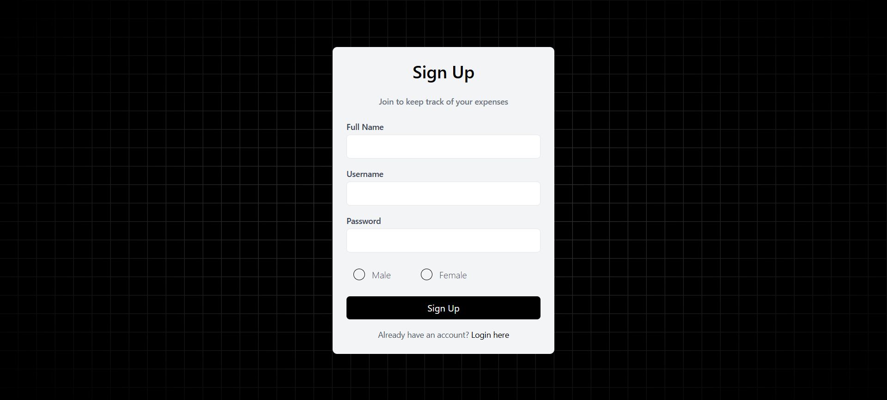
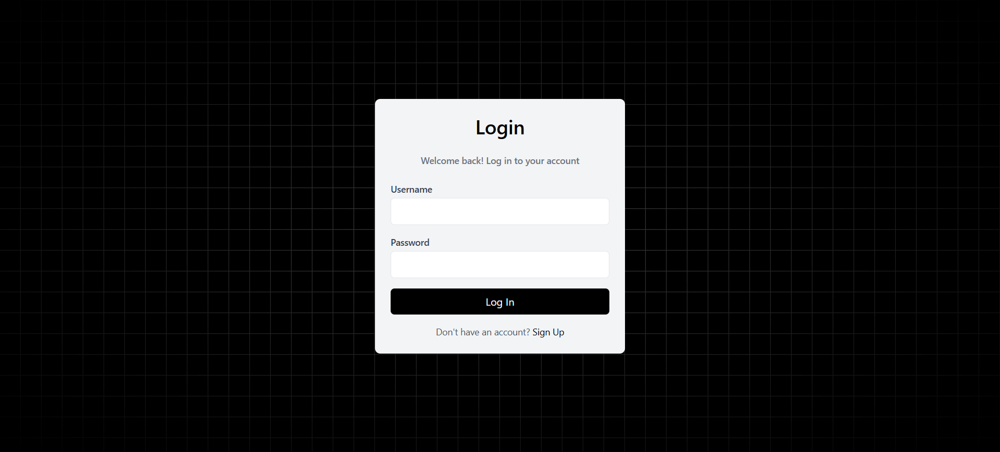
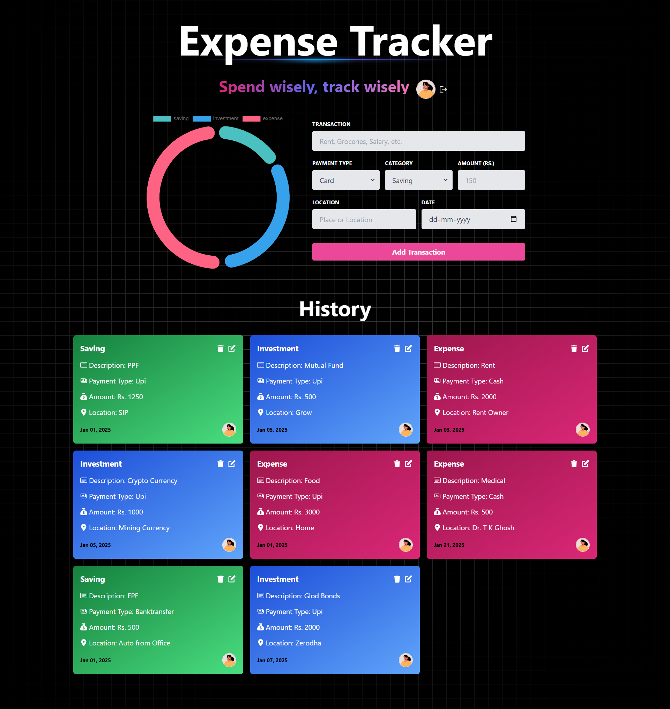
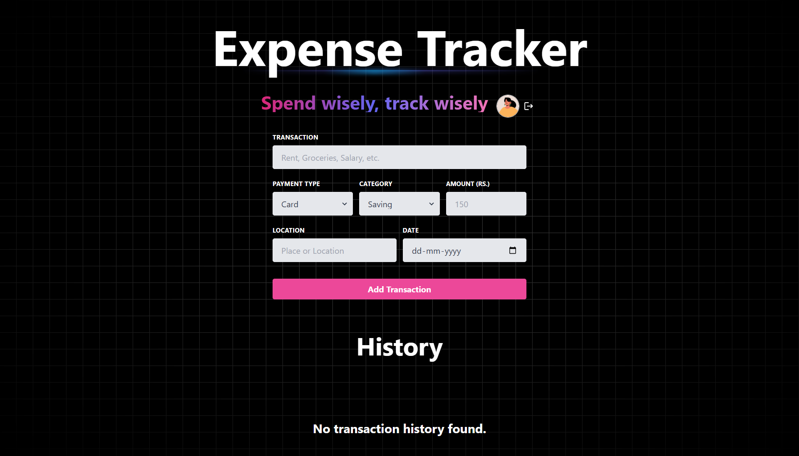
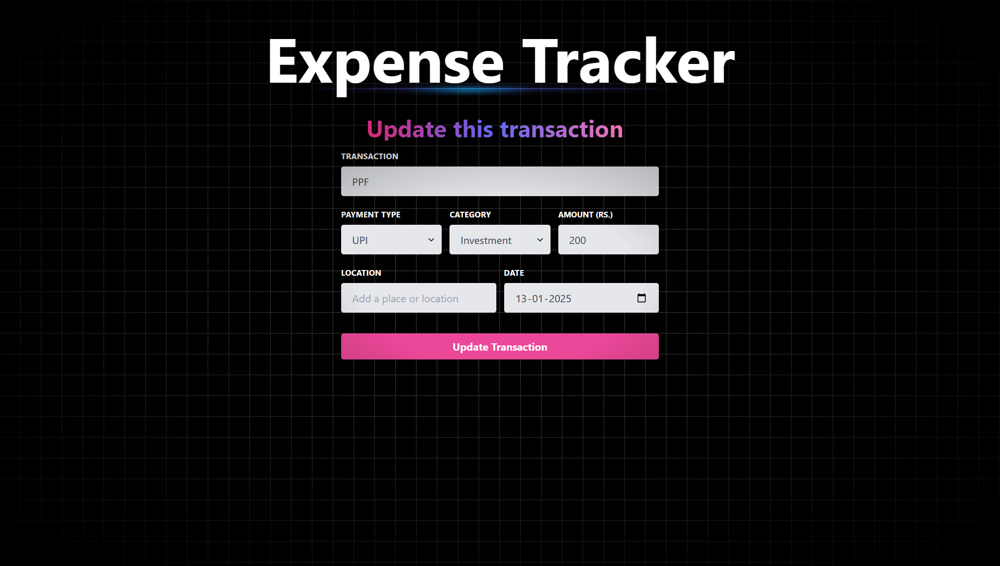

# React + Vite

This template provides a minimal setup to get React working in Vite with HMR and some ESLint rules.

Currently, two official plugins are available:

- [@vitejs/plugin-react](https://github.com/vitejs/vite-plugin-react/blob/main/packages/plugin-react/README.md) uses [Babel](https://babeljs.io/) for Fast Refresh
- [@vitejs/plugin-react-swc](https://github.com/vitejs/vite-plugin-react-swc) uses [SWC](https://swc.rs/) for Fast Refresh


 <br />
## Screens
- Sign UP Page
- Login Page
- Home Page
- Edit Transaction Page
- Error Page
  <br />

## Quick Glimpses of the site :

 <table>
  <tr>
    <td>Sign Up or Register Page</td>
    <td>Sign In or Log In Page</td>
  </tr>
  <tr>
    <td>Home Page with empty records </td>
    <td>Home Page </td>
  </tr>
  <tr>
    <td>Edit Record Page </td>
    <td>Error Page </td>
  </tr>
 </table>
<br/>

Here I have actually keep the frontend abd backend togather so that forntend and backend run in same domain and backend use frontend build folder.
# Getting Started

## Clone the repo
First, clone the repo:

```bash
git clone https://github.com/Rounak00/Expense_Tracker.git
```

## Add .env files that is the secret of this project
```bash
For backend find .env from config
For frontend find .env by search import.meta.env as its a vite project
```

## For Dev Run
```bash
at root> npm install
at root> npm run dev
```
```bash
at root/frontend> npm install
at root.frontend> npm run dev
```

## For Production Run
```bash
at root> npm run build
at root> npm run start
```


